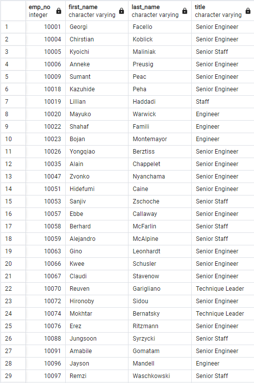
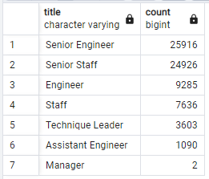
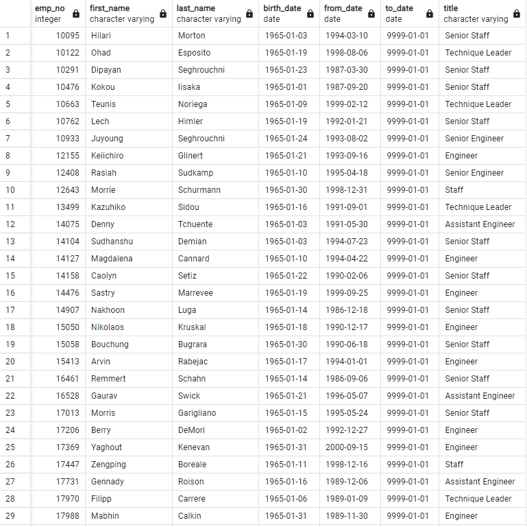
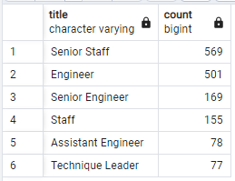
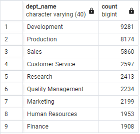

# Pewlett-Hackard-Analysis
## Overview of Project
Pewlett Hackard is a company that has been around for a long time. HR has begun employee research to offer retirement packages to those coming near retirement and also prepare for all the positions that will need to be filled.
## Purpose
The purpose of this project is to use PostgreSQL and pgAdmin to create a database and tables with all the information needed.
We also used Quick DBD to create an Entity Relationship Diagrams to connect all of our data.
## Results
### Unique Titles Table
- The unique titles table shows there are a total of 72,458 employees that are coming up for retirement. This table will show first name, last name, and title in employee number order.

### Retiring Table
- The following table shows the number of employees coming up to retire per title. The top three titles losing the most employees due to retirement will be Senior Engineers, Senior Staff, and Engineers.
- The bottom two titles losing the least employees due to retirement are Managers and Assistant Engineers.

### Mentorship Eligibility Table
- The mentorship eligibility table shows there are a total of 1,549 employees qualified for the mentorship program to train the employees filling the positions.
- When counting how many mentors per title, it shows that each mentor will have to train the following amount of employees for the company to fulfill all of the positions.
  - Senior Staff: 44 employees/mentor
  - Engineer: 19 employees/mentor
  - Senior Engineer: 153 employees/mentor
  - Staff: 49 employees/mentor
  - Assistant Engineer: 14 employees/mentor
  - Technique Leader: 47 employees/mentor

### Mentorship Eligibility Count Table

  
### Retiring per Department Table

## Summary
When the "silver tsunami" begins to make an impact a total of 72,458 positions will need to be filled. According to the mentorship eligibility table, there are not enough employees to mentor the next generation. The top three departments losing most employees to retirement are Development, Production, and Sales.
